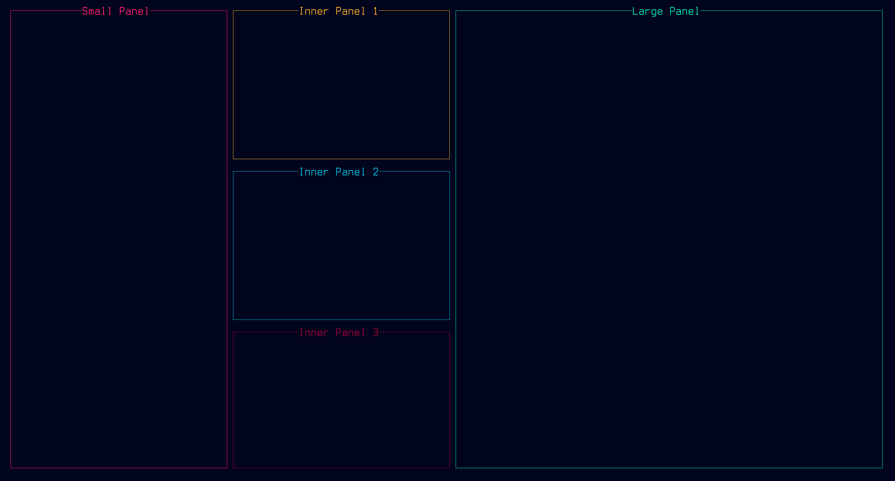

# vexes

A personal library/boilerplate for making ncurses applications.

__NOTE:__ This library was created for my personal use, so there are many
defaults and conventions I follow because they work for me. They may not work
for you, but feel free to use the library anyway. Make changes, add or remove
things, personalize it. It's open source, what else do you want from me?

------------------------------------------------------------------------------

Above you'll see a colorful version of demo2, which showcases the easy to use
layouts/sub-layouts feature of vexes.

## What's the deal with this library?

_vexes_ is a library meant to abstract away and simplify some of the more
annoying aspects of ncurses. It's filled with handy utilities and extensible
base classes for users to build upon and use in ways that make writing TUIs
easier and more fun.

The name is a play on _curses_, since _vexes_ are similar, but in my opinion
much cooler.

## How can I use this library in my own programs?

All you have to do is include the `vexes.hpp` header file and place the
implementation file in your source directory! For an example of how to use the
library, check out the demos included with the repo, which you can compile
yourself. Just run `make` from the base directory and it should create a
`demos` directory. There you can find the binaries for the demos, and you can
find the source code for them in the `src` directory.

## What can I expect to find in this library?

At the moment, here's what the library offers:

- Engine Base Class
    - Simple setup and run
- Drawing Utils
    - Quickly draw characters, strings, lines, boxes, and more
- Panel Base Class
    - Takes care of sizing, resizing, and drawing
    - Define custom draw methods
- Automatic Layouts
    - Generate custom layouts/sub-layouts, or use a library default
    - Easily regenerate dimensions for window resizing
- Form Base Class
    - Versatile single line input fields without form.h dependency

## What programs actually use this library?

Below you can find a list of projects that use vexes:

Project | Description
--------|------------
[cascade](https://github.com/Nynergy/cascade) | lightweight todo-list app made to test vexes in production
[scintilator](https://github.com/Nynergy/scintilator) | a pretty ASCII light show for the terminal

If you know of another app that uses vexes, or you're the creator of an app
that uses it, let me know and I can add you to the above table.

------------------------------------------------------------------------------

Remember, _don't curse,_ ___use vexes!___
